발표영상 : https://www.youtube.com/watch?v=glNhybFhy6Y

# 물류시스템의 최적화를 위한 도심형 무인 운송 로봇

물류 유통 시스템의 효율을 높이기 위해 아파트 단지 내부에서의 택배 운송을 모두 자동화하는 로봇 및 제어 시스템.

KW-특송

김태윤, 김지원, 이지원, 정세훈(전자통신공학과)

지도교수: 채주형&nbsp;&nbsp;&nbsp;&nbsp;산업체: 김성용 (에스오엑스 대표)

 

 

## 개요

 

## 참고 자료
- https://www.slideshare.net/chcbaram/opencr
- https://www.youtube.com/watch?v=667XSSxieXM
- https://www.youtube.com/watch?v=JMXz5tzpq7U
- https://www.youtube.com/watch?v=WEoLLpqMwhI
- https://linuxhint.com/map-viewers-linux/

